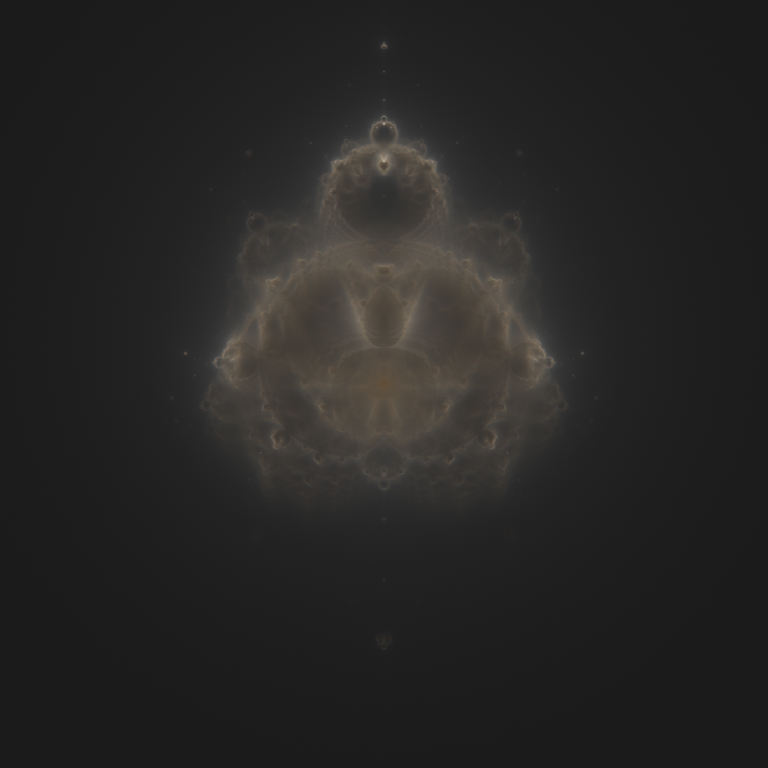

# Nebulae

A multi-threaded Nebulabrot renderer.



## Building

* Install Rust, using [the recommended "rustup" tool](https://www.rust-lang.org/tools/install)
* On the command line in the root folder, run `cargo build --release`
* Your executable, named `nebulae` will be placed in `target/release`

## Usage

* On the command line, with `nebulae` available in your `$PATH`:
  * To render with default settings, just run `nebulae`
  * Change the output file name with the `-c, --config <CONFIG>` option:
    ```sh
    nebulae -o my_render.png
    ```
  * To get help, run `nebulae help`  
    It should print the following:

        USAGE:
            nebulae [OPTIONS] [SUBCOMMAND]
        
        OPTIONS:
        -c, --config <CONFIG>     Configuration file
        -h, --help                Print help information
        -n, --no-intermediates    Do not write intermediate files
        -o, --output <OUTPUT>     File to write to [default: image.png]
        -V, --version             Print version information
        
        SUBCOMMANDS:
        help             Print this message or the help of the given subcommand(s)
        wizard           Display configuration wizard
        write-default    Write the default configuration to TOML

### Configuration

Configuration files can be provided as `.toml` files, using the following as a template:
```toml
# Iteration multiplier for each of the red, green, and blue channels
# Must be an array of three integers
limits = [
  7740,
  2580,
  860,
]
# Number of random samples to take, per channel, per pass
samples = 1000000
# Number of passes to run
passes = 100
# Resolution of the rendered image (size × size pixels)
size = 2048
# Colour correction curve to apply (value between 0 and 1, raised to this power)
curve = 0.5
```

To pass use a configuration file, use the `-c, --config <CONFIG>` option:
```sh
nebulae -c my_config.toml
```

To output a configuration file (with `wizard` and `write-default` subcommands), use the `-c, --config <CONFIG>`" option:
```sh
nebulae wizard -s new_config.toml
```

To speed up total rendering time, you can choose not to output an image after each pass with the `-n, --no-intermediates` flag.

### Subcommands

#### `write-default`

Simply prints the default configuration in TOML format.

#### `wizard`

Guides you through a simple configuration with some nice defaults.

